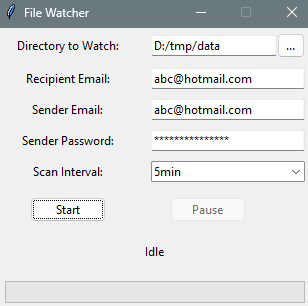

# File Watcher Application

This project is a Python GUI application that monitors a specified directory for new files with the extensions `.csv` and `.txt`. It checks for new files at a user-defined interval and sends any detected files via email to a specified address.

## Project Structure

```
file-watcher-app
├── src
│   ├── main.py          # Main entry point of the application
│   └── utils
│       └── email_sender.py  # Utility for sending emails with attachments
├── requirements.txt     # Project dependencies
├── img
│   └── screenshot.png   # Screenshot of the application
├── README.md            # Project documentation
└── LICENSE              # Project license
```

## Setup Instructions

1. Clone the repository:
   ```sh
   git clone https://github.com/microsoft/vscode-remote-try-python.git
   cd file-watcher-app
   ```

2. Install the required dependencies:
   ```sh
   pip install -r requirements.txt
   ```

3. Configure the email settings in `src/utils/email_sender.py` to specify the email account and recipient.

## Usage

1. Run the application:
   ```sh
   python src/main.py
   ```

2. The application will start and display a GUI. Use the GUI to specify the directory to watch, the recipient email, the sender email, and the sender password. You can also set the scan interval.

3. The application will start monitoring the specified directory. If new `.csv` or `.txt` files are added, they will be sent to the configured email address.

## Screenshot



## License

This project is licensed under the MIT License.